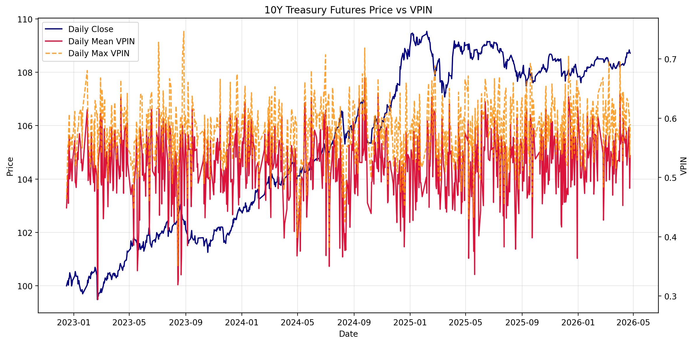
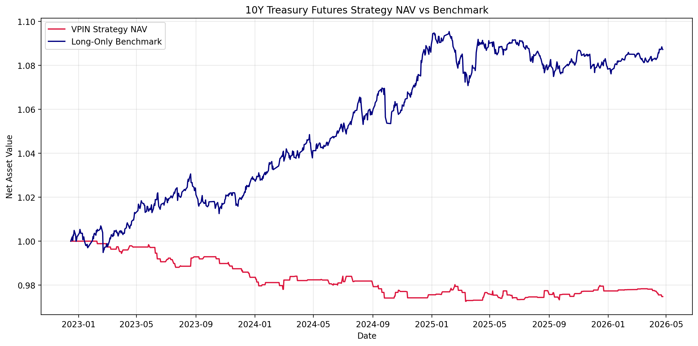
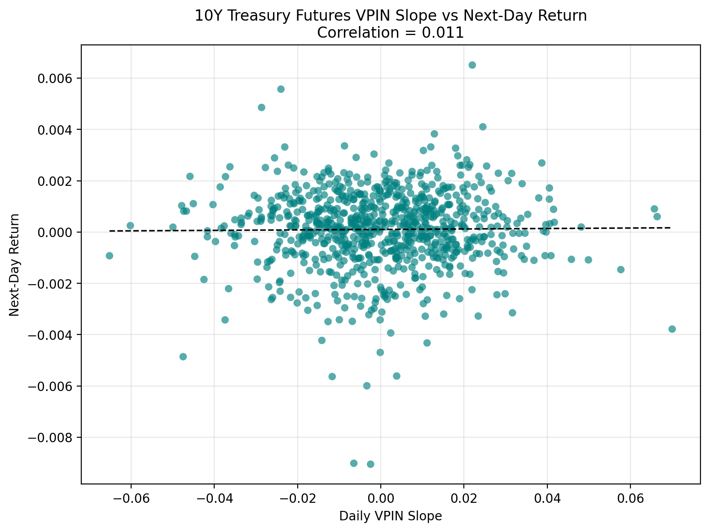
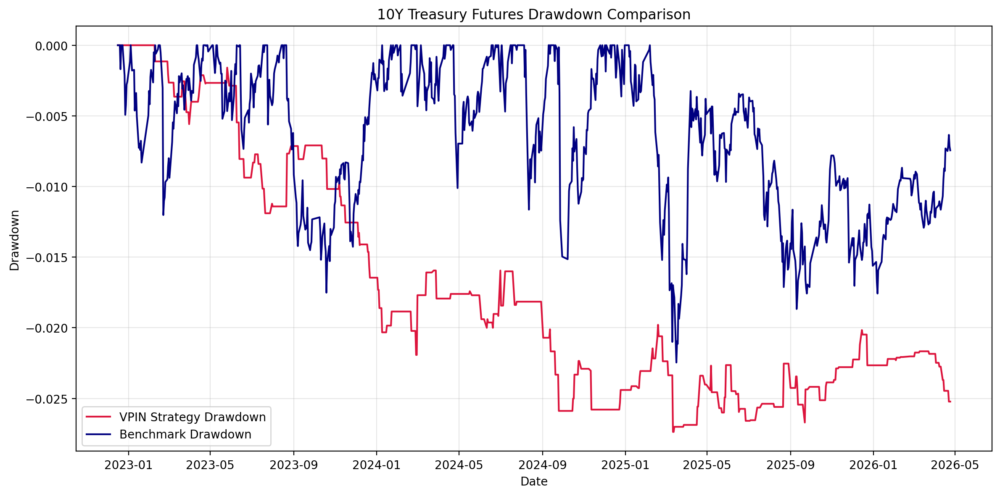
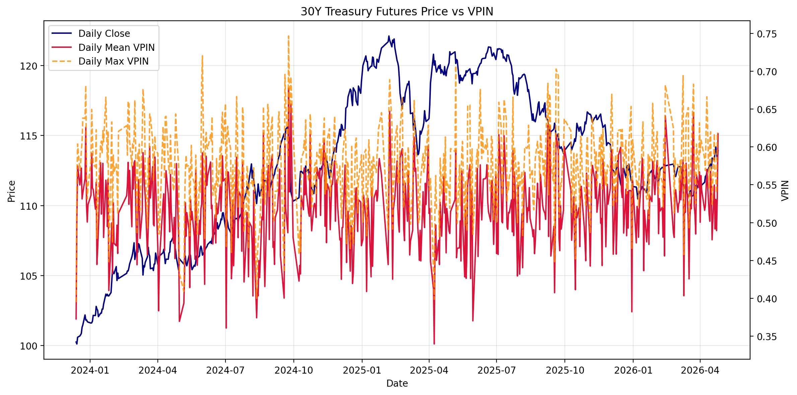
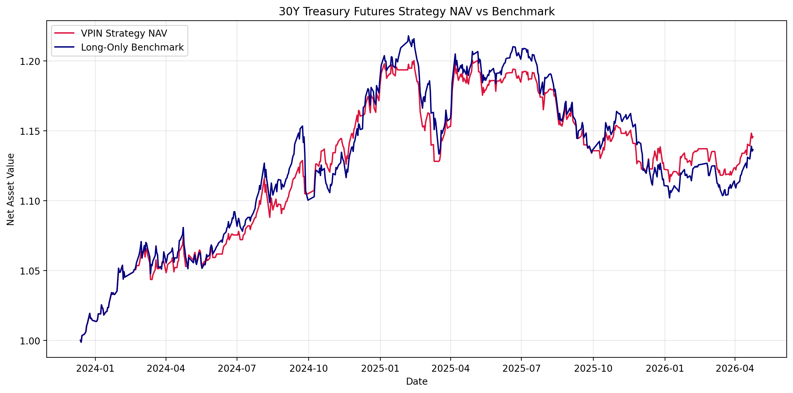
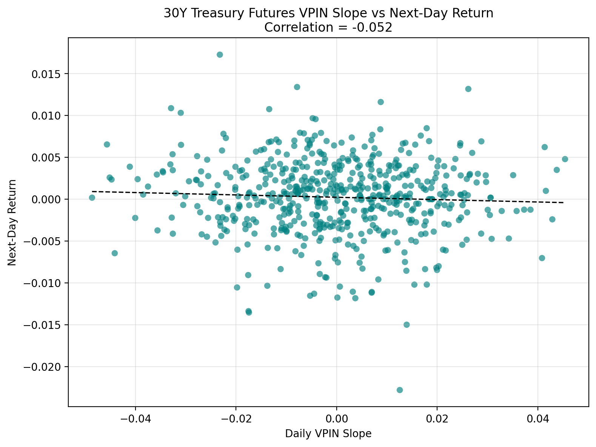
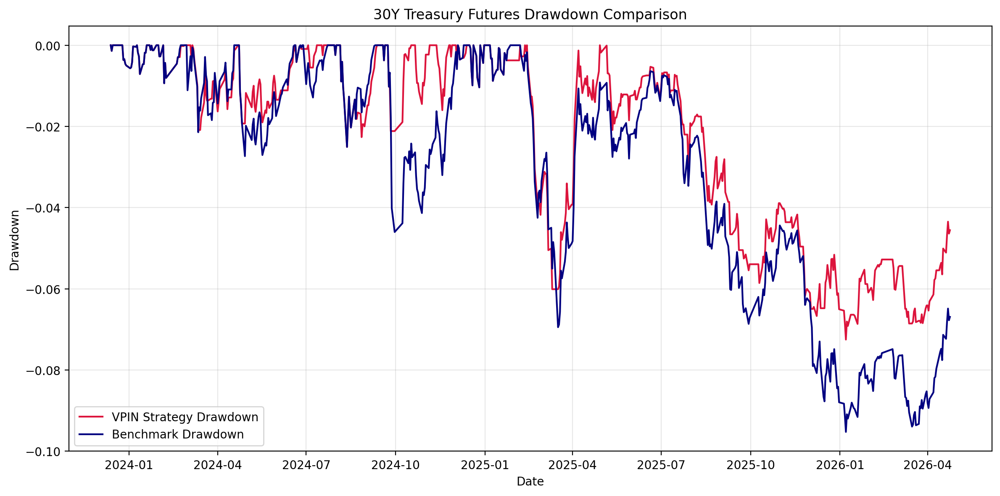

# 基于 VPIN 的中国国债期货择时框架 | VPIN-Based Timing Strategy for Chinese Government Bond Futures

<p align="center">
  <a href="#zh"></a>
  <a href="#en"></a>
</p>

<a id="zh"></a>

## 简体中文

当前语言：中文 | [Switch to English](#en)

---

### 项目简介

本项目是一个基于 **VPIN（Volume-Synchronized Probability of Informed Trading）** 的中国国债期货 **CTA 风格空头风险择时框架**。项目使用分钟级交易数据构建订单流毒性指标，并检验 VPIN 对 `T`（10 年国债期货）和 `TL`（30 年国债期货）短周期空头风险识别、风险暴露切换与防御择时的解释力。

当前研究逻辑专注于 VPIN：当订单流毒性升高且 VPIN 斜率走强时，策略将其视为潜在的交易性空头/下行风险信号，并从多头暴露切换到空仓防御状态。当前实现是多头 / 空仓版本的 CTA 择时原型，并不直接建立期货空头头寸，也不包含均线、动量、波动率、RSRS、MACD、RSI、布林带等非 VPIN 策略。

### VPIN 指标解释

VPIN = **Volume-Synchronized Probability of Informed Trading**，即知情交易概率。该指标由 David Easley、Maureen O'Hara 以及 Marcos M. López de Prado 等提出，用于捕捉市场微观结构恶化、订单流毒性和流动性枯竭风险。

与传统基于日历时间等距采样的方法不同，VPIN 引入“等量桶”（Volume Buckets）概念，将连续交易数据按照固定成交量进行切分，从而降低高频数据中的波动率聚集影响，更接近真实交易节奏。

VPIN 衡量的是一段时间内买卖成交量失衡程度。若买卖量长期失衡，说明订单流可能更具毒性，市场可能面临信息交易压力、流动性恶化或价格跳变风险。

$$
VPIN = \frac{\sum_{\tau=1}^{n} |V_{\tau}^{S} - V_{\tau}^{B}|}{nV}
$$

其中：

- \(V_{\tau}^{B}\)：第 \(\tau\) 个等量桶内估计的买入成交量；
- \(V_{\tau}^{S}\)：第 \(\tau\) 个等量桶内估计的卖出成交量；
- \(V\)：单个等量桶的固定成交量；
- \(n\)：滚动窗口内的等量桶数量。

在中国国债期货 `T` / `TL` 合约中，VPIN 可以被理解为订单流毒性或交易拥挤程度的代理变量。当 VPIN 快速上升时，可能意味着市场交易方向更加单边，未来短期价格波动或回撤风险上升。因此，本项目使用“高 VPIN + VPIN slope 为正”作为降低多头仓位的风险预警条件。

### 核心功能

- 分钟级国债期货数据读取与标准化；
- VPIN 指标计算；
- 日频 VPIN 特征聚合；
- VPIN 空头风险 / 防御择时信号生成；
- CTA 风格多头 / 空仓切换策略回测；
- 绩效指标统计；
- 可视化输出。

### 方法框架

主脚本 `vpin_timing.py` 使用分钟级数据（优先 5 分钟）完成以下流程：

1. 读取并标准化分钟级行情数据；
2. 使用价格变化方向或 Bulk Volume Classification 近似拆分买量和卖量；
3. 计算分钟级 VPIN、VPIN slope、z-score 和 percentile；
4. 将 VPIN 特征聚合到日频；
5. 根据日频 VPIN 分位数和斜率生成空头风险 / 防御择时信号；
6. 使用日频 close-to-close 收益回测 CTA 风格多头 / 空仓切换策略；
7. 输出净值、绩效指标和图表。

为避免未来函数，交易仓位使用：

```python
position = signal_raw.shift(1)
```

即所有信号严格滞后 1 个交易日执行。

### 仓库结构

当前仓库结构以实际文件为准：

```text
.
├── LICENSE
├── README.md
├── vpin_timing.py
├── 10年国债期货_5min_3年.xlsx
├── 30年国债期货_5min_2年.xlsx
├── data/
│   └── processed/
│       ├── vpin_intraday.csv
│       └── vpin_daily.csv
├── results/
│   ├── report.md
│   ├── tables/
│   │   ├── backtest_summary.csv
│   │   └── strategy_nav.csv
│   └── figures/
│       ├── t_price_vs_vpin.png
│       ├── t_vpin_slope_vs_return.png
│       ├── t_strategy_nav_vs_benchmark.png
│       ├── t_drawdown_comparison.png
│       ├── tl_price_vs_vpin.png
│       ├── tl_vpin_slope_vs_return.png
│       ├── tl_strategy_nav_vs_benchmark.png
│       └── tl_drawdown_comparison.png
└── report/
    └── *.pdf
```

说明：

- 当前仓库未发现 `src/` 目录；
- 当前仓库未发现 `scripts/` 目录；
- 当前仓库未发现 `requirements.txt`；
- `data/processed/`、`results/tables/` 和 `results/figures/` 中的文件为当前已有 pipeline 输出；
- `results/report.md` 是正式双语研究报告；
- `LICENSE` 声明本项目采用 MIT 协议。

### 输入数据格式

输入文件支持 `csv`、`xls`、`xlsx`，标准字段为：

- `datetime`
- `open`
- `high`
- `low`
- `close`
- `volume`
- `open_interest`

脚本兼容以下常见别名：

- `time` / `date` / `timestamp` / `时间` → `datetime`
- `oi` / `持仓量` → `open_interest`
- `vol` / `成交量` → `volume`

仓库默认输入文件：

- `10年国债期货_5min_3年.xlsx`
- `30年国债期货_5min_2年.xlsx`

### 输出文件

表格输出：

- `data/processed/vpin_intraday.csv`
- `data/processed/vpin_daily.csv`
- `results/tables/backtest_summary.csv`
- `results/tables/strategy_nav.csv`

图表输出：

- `results/figures/t_price_vs_vpin.png`
- `results/figures/t_vpin_slope_vs_return.png`
- `results/figures/t_strategy_nav_vs_benchmark.png`
- `results/figures/t_drawdown_comparison.png`
- `results/figures/tl_price_vs_vpin.png`
- `results/figures/tl_vpin_slope_vs_return.png`
- `results/figures/tl_strategy_nav_vs_benchmark.png`
- `results/figures/tl_drawdown_comparison.png`

### 已有回测结果

以下结果来自当前仓库中的 `results/tables/backtest_summary.csv`，未额外推断或编造。

| 合约 | 策略 | 累计收益 | 年化收益 | 年化波动率 | 夏普比率 | 最大回撤 | Calmar | 胜率 | 换手率 |
|---|---|---:|---:|---:|---:|---:|---:|---:|---:|
| T | long_only_benchmark | 0.088304 | 0.026710 | 0.024207 | 1.103373 | 0.022459 | 1.189279 | 0.559951 | 0.000000 |
| T | vpin_strategy | 0.061142 | 0.018658 | 0.022427 | 0.831940 | 0.026380 | 0.707262 | 0.463535 | 0.276885 |
| TL | long_only_benchmark | 0.136346 | 0.058031 | 0.070550 | 0.822552 | 0.095250 | 0.609252 | 0.558669 | 0.000000 |
| TL | vpin_strategy | 0.145706 | 0.061869 | 0.061949 | 0.998711 | 0.072508 | 0.853273 | 0.467601 | 0.245184 |

### 结果图表

#### T 合约

<p align="center">
  
  
</p>

<p align="center">
  
  
</p>

#### TL 合约

<p align="center">
  
  
</p>

<p align="center">
  
  
</p>

### 快速开始

克隆仓库：

```bash
git clone https://github.com/ericxuzhesheng/VPIN-Based-Timing-Strategy-for-Chinese-Government-Bond-Futures.git
cd VPIN-Based-Timing-Strategy-for-Chinese-Government-Bond-Futures
```

安装依赖：

```bash
pip install pandas numpy matplotlib openpyxl scipy
```

准备数据：

- 使用仓库默认 Excel 文件：`10年国债期货_5min_3年.xlsx` 和 `30年国债期货_5min_2年.xlsx`；或
- 准备自定义分钟级数据文件，并确保包含可被标准化为 `datetime`、`open`、`high`、`low`、`close`、`volume` 的字段。

运行完整 pipeline：

```bash
python vpin_timing.py
```

### 运行命令

运行两个合约：

```bash
python vpin_timing.py
```

仅运行 `T`：

```bash
python vpin_timing.py --contract T
```

仅运行 `TL`：

```bash
python vpin_timing.py --contract TL
```

指定自定义输入文件：

```bash
python vpin_timing.py --contract T --input data/raw/T_5min.csv
```

指定起始日期和输出目录：

```bash
python vpin_timing.py --start-date 2024-01-01 --output-dir results --processed-dir data/processed
```

### 主要参数

- `--classification-method`：`bvc` 或 `tick`
- `--classification-window`：BVC 波动率缩放窗口
- `--vpin-window`：VPIN 滚动窗口
- `--slope-window`：分钟级 VPIN slope 窗口
- `--zscore-window`：分钟级 VPIN z-score 窗口
- `--percentile-window`：分钟级 VPIN percentile 窗口
- `--daily-slope-window`：日频 VPIN slope 窗口
- `--daily-stats-window`：日频 z-score / percentile 窗口
- `--signal-percentile-threshold`：高 VPIN 分位阈值
- `--signal-slope-threshold`：VPIN slope 阈值
- `--transaction-cost`：按换手施加的单边交易成本

---

<a id="en"></a>

## English

Current language: English | [切换到中文](#zh)

---

### Project Overview

This repository provides a **VPIN (Volume-Synchronized Probability of Informed Trading)** based **CTA-style short-risk timing framework** for Chinese government bond futures. It uses minute-level trading data to construct order-flow toxicity indicators and evaluates the explanatory power of VPIN for short-horizon short-risk detection, risk-exposure switching, and defensive timing in `T` 10-year and `TL` 30-year government bond futures.

The current research logic focuses only on VPIN: when order-flow toxicity rises and the VPIN slope strengthens, the strategy treats it as a potential trading-oriented short/downside-risk signal and switches from long exposure to a flat defensive state. The current implementation is a long/flat CTA timing prototype; it does not directly open short futures positions and does not include non-VPIN rules such as moving averages, momentum, volatility filters, RSRS, MACD, RSI, or Bollinger Bands.

### VPIN Indicator

VPIN stands for **Volume-Synchronized Probability of Informed Trading**. The indicator was proposed by David Easley, Maureen O'Hara, Marcos M. López de Prado and co-authors to measure market microstructure stress, order-flow toxicity, and the risk of deteriorating liquidity.

Unlike calendar-time sampling, VPIN uses volume buckets: trades are grouped by fixed volume rather than fixed clock intervals. This volume-synchronized view reduces the impact of volatility clustering in high-frequency data and better reflects the market's actual trading rhythm.

VPIN measures buy-sell volume imbalance within rolling volume buckets. Higher VPIN indicates stronger order-flow toxicity and potentially worse liquidity conditions, especially when one-sided trading pressure persists.

$$
VPIN = \frac{\sum_{\tau=1}^{n} |V_{\tau}^{S} - V_{\tau}^{B}|}{nV}
$$

Where:

- \(V_{\tau}^{B}\) is the estimated buy volume in volume bucket \(\tau\);
- \(V_{\tau}^{S}\) is the estimated sell volume in volume bucket \(\tau\);
- \(V\) is the fixed volume size of each bucket;
- \(n\) is the number of buckets in the rolling VPIN window.

In this project, high VPIN combined with positive VPIN slope is used as a defensive timing signal for Chinese Government Bond Futures. For `T` and `TL`, a rapid VPIN increase is interpreted as a warning that trading flow is becoming more one-sided and that short-term volatility or drawdown risk may rise.

### Core Features

- Minute-level government bond futures data loading and standardization;
- VPIN indicator calculation;
- Daily VPIN feature aggregation;
- VPIN short-risk / defensive timing signal generation;
- CTA-style long/flat switching strategy backtesting;
- Performance metric calculation;
- Visualization output.

### Methodology

The main script `vpin_timing.py` uses minute-level data, preferably 5-minute bars, and runs the following workflow:

1. Load and standardize minute-level market data;
2. Approximate buy and sell volume using price direction or Bulk Volume Classification;
3. Compute intraday VPIN, VPIN slope, z-score, and percentile;
4. Aggregate VPIN features to daily frequency;
5. Generate short-risk / defensive timing signals from daily VPIN percentile and slope;
6. Backtest a CTA-style long/flat switching strategy with daily close-to-close returns;
7. Export NAV series, performance metrics, and figures.

To avoid look-ahead bias, the tradable position is defined as:

```python
position = signal_raw.shift(1)
```

Therefore, every signal is executed with a strict one-trading-day lag.

### Repository Structure

The repository structure below reflects the actual inspected files:

```text
.
├── LICENSE
├── README.md
├── vpin_timing.py
├── 10年国债期货_5min_3年.xlsx
├── 30年国债期货_5min_2年.xlsx
├── data/
│   └── processed/
│       ├── vpin_intraday.csv
│       └── vpin_daily.csv
├── results/
│   ├── report.md
│   ├── tables/
│   │   ├── backtest_summary.csv
│   │   └── strategy_nav.csv
│   └── figures/
│       ├── t_price_vs_vpin.png
│       ├── t_vpin_slope_vs_return.png
│       ├── t_strategy_nav_vs_benchmark.png
│       ├── t_drawdown_comparison.png
│       ├── tl_price_vs_vpin.png
│       ├── tl_vpin_slope_vs_return.png
│       ├── tl_strategy_nav_vs_benchmark.png
│       └── tl_drawdown_comparison.png
└── report/
    └── *.pdf
```

Notes:

- No `src/` directory was found in the current repository;
- No `scripts/` directory was found in the current repository;
- No `requirements.txt` file was found in the current repository;
- Files under `data/processed/`, `results/tables/`, and `results/figures/` are existing pipeline outputs;
- `results/report.md` is the formal bilingual research report;
- `LICENSE` declares that this project is released under the MIT License.

### Input Data Schema

Supported input formats are `csv`, `xls`, and `xlsx`. The standardized columns are:

- `datetime`
- `open`
- `high`
- `low`
- `close`
- `volume`
- `open_interest`

Common aliases are supported automatically:

- `time` / `date` / `timestamp` / `时间` → `datetime`
- `oi` / `持仓量` → `open_interest`
- `vol` / `成交量` → `volume`

Default local input files:

- `10年国债期货_5min_3年.xlsx`
- `30年国债期货_5min_2年.xlsx`

### Output Files

Tables:

- `data/processed/vpin_intraday.csv`
- `data/processed/vpin_daily.csv`
- `results/tables/backtest_summary.csv`
- `results/tables/strategy_nav.csv`

Figures:

- `results/figures/t_price_vs_vpin.png`
- `results/figures/t_vpin_slope_vs_return.png`
- `results/figures/t_strategy_nav_vs_benchmark.png`
- `results/figures/t_drawdown_comparison.png`
- `results/figures/tl_price_vs_vpin.png`
- `results/figures/tl_vpin_slope_vs_return.png`
- `results/figures/tl_strategy_nav_vs_benchmark.png`
- `results/figures/tl_drawdown_comparison.png`

### Existing Backtest Results

The following results come from the existing `results/tables/backtest_summary.csv` file. No additional performance numbers are inferred or fabricated.

| Contract | Strategy | Cumulative Return | Annualized Return | Annualized Volatility | Sharpe Ratio | Max Drawdown | Calmar | Win Rate | Turnover |
|---|---|---:|---:|---:|---:|---:|---:|---:|---:|
| T | long_only_benchmark | 0.088304 | 0.026710 | 0.024207 | 1.103373 | 0.022459 | 1.189279 | 0.559951 | 0.000000 |
| T | vpin_strategy | 0.061142 | 0.018658 | 0.022427 | 0.831940 | 0.026380 | 0.707262 | 0.463535 | 0.276885 |
| TL | long_only_benchmark | 0.136346 | 0.058031 | 0.070550 | 0.822552 | 0.095250 | 0.609252 | 0.558669 | 0.000000 |
| TL | vpin_strategy | 0.145706 | 0.061869 | 0.061949 | 0.998711 | 0.072508 | 0.853273 | 0.467601 | 0.245184 |

### Result Figures

#### T Contract

<p align="center">
  
  
</p>

<p align="center">
  
  
</p>

#### TL Contract

<p align="center">
  
  
</p>

<p align="center">
  
  
</p>

### Quick Start

Clone the repository:

```bash
git clone https://github.com/ericxuzhesheng/VPIN-Based-Timing-Strategy-for-Chinese-Government-Bond-Futures.git
cd VPIN-Based-Timing-Strategy-for-Chinese-Government-Bond-Futures
```

Install dependencies:

```bash
pip install pandas numpy matplotlib openpyxl scipy
```

Prepare data:

- Use the default Excel files: `10年国债期货_5min_3年.xlsx` and `30年国债期货_5min_2年.xlsx`; or
- Prepare a custom minute-level data file with fields that can be standardized to `datetime`, `open`, `high`, `low`, `close`, and `volume`.

Run the full pipeline:

```bash
python vpin_timing.py
```

### Run Commands

Run both contracts:

```bash
python vpin_timing.py
```

Run only `T`:

```bash
python vpin_timing.py --contract T
```

Run only `TL`:

```bash
python vpin_timing.py --contract TL
```

Use a custom input file:

```bash
python vpin_timing.py --contract T --input data/raw/T_5min.csv
```

Specify a start date and output directories:

```bash
python vpin_timing.py --start-date 2024-01-01 --output-dir results --processed-dir data/processed
```

### Key Parameters

- `--classification-method`: `bvc` or `tick`
- `--classification-window`: BVC volatility scaling window
- `--vpin-window`: VPIN rolling window
- `--slope-window`: intraday VPIN slope window
- `--zscore-window`: intraday VPIN z-score window
- `--percentile-window`: intraday VPIN percentile window
- `--daily-slope-window`: daily VPIN slope window
- `--daily-stats-window`: daily z-score / percentile window
- `--signal-percentile-threshold`: high-VPIN percentile threshold
- `--signal-slope-threshold`: VPIN slope threshold
- `--transaction-cost`: one-way transaction cost applied to turnover
