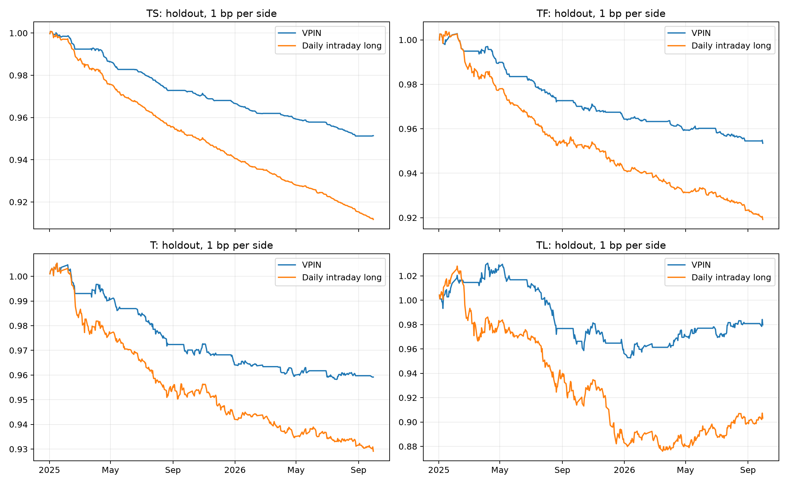

# 四品种一分钟 VPIN 研究

**单边 1 bp 成本的固定检验段，四品种策略均亏损。**相同日内口径下相较每日全多基准亏损较少，但降低暴露和交易次数本身会减少成本，不能据此证明 VPIN 具有方向预测能力或可以实盘盈利。

本次修复了旧实现将固定分钟根误当固定成交量桶的问题。源数据扩展和正确的因果计算不保证策略收益提高。

只使用 Tushare 真实月合约；完整日由历史交易时段确定，缺分钟和缺开市日不插值。各品种有效范围见下表。

早期 TS 有 118 个已入场日无法从零成交末根验证平仓；另有无上午成交入口的日子未入场。这些日的源数据、桶、特征和失败账本保留，TS 早期历史及全历史完整绩效不披露。见 [受限绩效范围](metrics_blocked.csv) 和 本地失败平仓账本 `TS_execution_failures.csv`（不随 Git 发布）。四品种 2023 年起均没有平仓验证失败。

| 品种 | 完整分钟根 | 完整交易日 | 首根 | 末根 | 不完整观察日 | 整日缺口 |
|---|---:|---:|---|---|---:|---:|
| TS | 509,040 | 1,969 | 2018-08-20 09:16:00 | 2026-09-30 15:15:00 | 0 | 0 |
| TF | 834,660 | 3,175 | 2013-09-09 09:16:00 | 2026-09-30 15:15:00 | 0 | 0 |
| T | 734,760 | 2,805 | 2015-03-23 09:16:00 | 2026-09-30 15:15:00 | 0 | 0 |
| TL | 212,925 | 835 | 2023-04-24 09:31:00 | 2026-09-30 15:15:00 | 0 | 0 |

执行前一开市日收盘后信号，下一日第二根开盘代理入场、末根收盘代理平仓；第二根零量时等待后续上午有量根。策略与基准均每日进出同一合约，没有隔夜或跨合约价差收益。换月和缺口重置成交量桶/价格尺度，换月日不沿用旧合约信号。

分钟 OHLC 和成交量只能支持理想成交研究，没有真实 bid/ask、撮合顺序或市场冲击验证。零量根不会被当作成交。所有价格百分比均为名义本金收益，未使用保证金杠杆。

预先固定 8 格在 2023 训练段按四品种等权净收益夏普选择：**ADV/25、20 桶窗口、0.8 分位阈值**。TL 训练只有上市后月份。2024 只验证，2025 年起固定检验，不重新选参数。详见 [研究协议](protocol.md) 和 [选择表](training_selection.csv)。

下表是固定检验段单边 1 bp 成本结果；基准同样扣每日两次成交成本。

| 品种 | 策略 | 天数 | 累计收益 | 年化收益 | 夏普 | 最大回撤 | 平均仓位 |
|---|---|---:|---:|---:|---:|---:|---:|
| TS | strategy | 424 | -4.86% | -2.92% | -7.083 | 4.95% | 54.48% |
| TS | benchmark | 424 | -8.83% | -5.34% | -10.246 | 8.90% | 100.00% |
| TF | strategy | 424 | -4.65% | -2.79% | -3.414 | 4.92% | 53.77% |
| TF | benchmark | 424 | -8.08% | -4.88% | -4.073 | 8.43% | 100.00% |
| T | strategy | 424 | -4.08% | -2.45% | -2.083 | 4.69% | 57.08% |
| T | benchmark | 424 | -7.09% | -4.28% | -2.579 | 7.58% | 100.00% |
| TL | strategy | 424 | -2.03% | -1.21% | -0.325 | 7.55% | 53.54% |
| TL | benchmark | 424 | -9.68% | -5.87% | -1.155 | 14.79% | 100.00% |

成本敏感性（固定检验段策略累计收益，单边成本）：

| 品种 | 0 bp | 1 bp | 3 bp |
|---|---:|---:|---:|
| TS | -0.36% | -4.86% | -13.26% |
| TF | -0.20% | -4.65% | -12.97% |
| T | 0.67% | -4.08% | -12.94% |
| TL | 2.52% | -2.03% | -10.53% |



更早历史仍保留用于在线热身和描述。由于已使用 2023 年挑选参数，全历史汇总及 2023 年前段不能称为新的独立样本外结果。各段与单边 0/1/3 bp 敏感性见 [完整结果](summary.csv)。

BVC 是由价格变化估计成交方向；分类尺度只用过去 200 根，至少 50 根过去变化热身。ADV 只用过去 20 个完整开市日，在每个连续合约段开始时锁定。部分分钟按固定比例跨桶分配，未满桶不发布 VPIN。日分位参照排除当前值。明细见 [桶守恒审计](bucket_audit.csv)、[日特征](daily_features.csv)、本地执行账本 `execution_ledger.csv`（不随 Git 发布）、[数据质量](data_quality.csv)。

公共源跨频核验保留了分钟与日线差异：TF1312 在 2013-11-19 的分钟收盘 90.100 与日线 90.940 不同，持仓相差 1197；没有使用日线修补分钟源。这发生于 2023 年训练之前，相关全历史描述须结合该质量问题解释。分钟成交量与日线成交量也可能因历史计数及竞价口径不同而有差异，本文成交量桶只按 Tushare 分钟 volume 计算，未声称两种频率的成交量完全相等。

VPIN 的经济解释和预测能力存在学术争议，本结果不能把 BVC 估计值解释为真实主动买卖量或知情交易概率，也不构成可成交性证明。

复现：

```powershell
python vpin_timing.py --data-dir "path/to/cgb-market-data"
python scripts/verify_minute_vpin.py --data-dir "path/to/cgb-market-data"
```

[VPIN 原始理论说明](https://www.quantresearch.org/VPIN.pdf)；[Andersen、Bondarenko 的分类准确性研究](https://repec.econ.au.dk/repec/creates/rp/13/rp13_43.pdf)。

执行账本及全部分钟/桶数据保留在本地；按上方命令重新获取自己的行情数据并运行研究即可生成。
